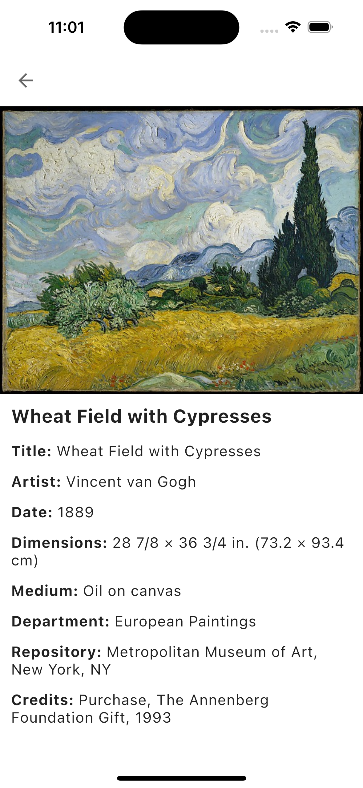
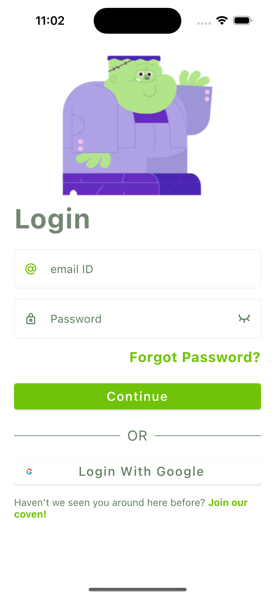
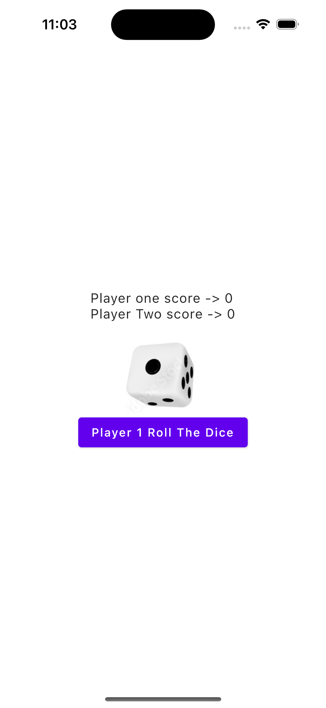
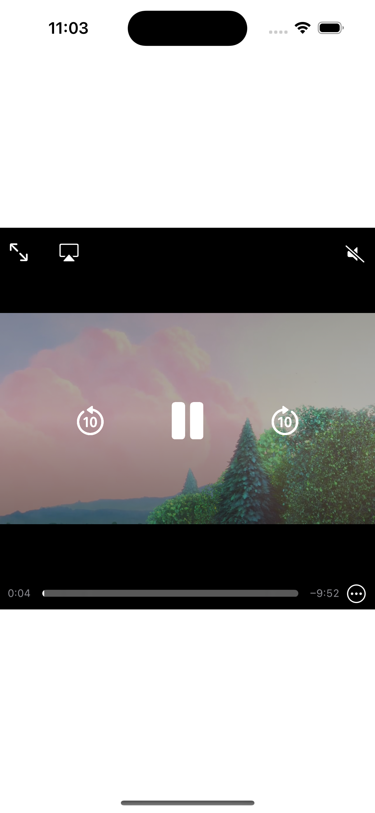
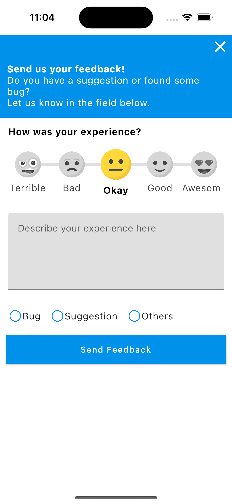

# Kotlin Multiplatform app template

This is a basic Kotlin Multiplatform app template for Android and iOS. It includes shared business logic and data handling, and a shared UI implementation using Compose Multiplatform.

### Technologies

The data displayed by the app is from [The Metropolitan Museum of Art Collection API](https://metmuseum.github.io/).

The app uses the following multiplatform dependencies in its implementation:

- [Compose Multiplatform](https://jb.gg/compose) for UI
- [Ktor](https://ktor.io/) for networking
- [kotlinx.serialization](https://github.com/Kotlin/kotlinx.serialization) for JSON handling
- [Kamel](https://github.com/Kamel-Media/Kamel) for image loading
- [moko-resources](https://github.com/icerockdev/moko-resources) for string resources
- [Koin](https://github.com/InsertKoinIO/koin) for dependency injection
- [Voyager](https://github.com/adrielcafe/voyager) for navigation and screen models

> These are just some of the possible libraries to use for these tasks with Kotlin Multiplatform, and their usage here isn't a strong recommendation for these specific libraries over the available alternatives. You can find a wide variety of curated multiplatform libraries in the [kmp-awesome](https://github.com/terrakok/kmp-awesome) repository.
